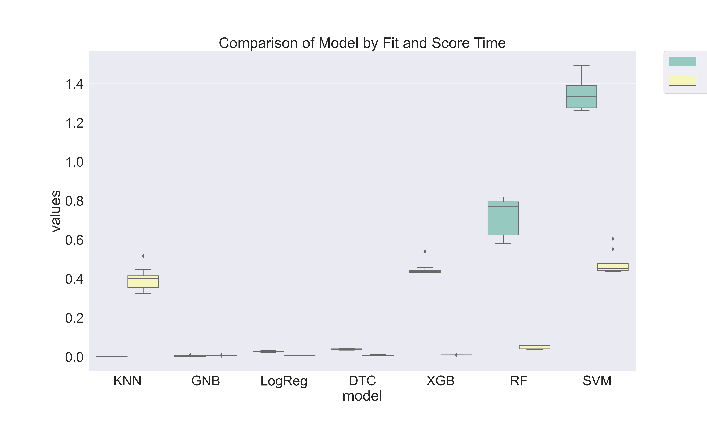

# Predicting Employee Churn

This project was undertaken as a solo project and completed as part of the General Assembly Data Science Immersive bootcamp over a 5 week period. This ReadMe discusses the problem, hypothesis, methodology, conclusion, and tools used.

## Problem Statement
Employee turnover or churn is a costly problem for companies and is the rate at which an employer gains and losses employees. 
The cost of replacing an employee can be significant - because of the productivity losses when employees leave the workforce, the costs of hiring and training a replacement, and the slower productivity until they get up to speed in their new job. Studies show that the estimated cost of losing an employee can cost an organization between 150% - 200% of salary.
## Project Objective
Understanding why and when employees are most likely to leave can lead to actions to improve employee retention as well as possibly planning new hiring in advance. 
My objective for this project is to:
- Determine the likelihood of an employee leaving ("leaver")
- Determine the key indicators for a "leaver"
- Develop and deploy a model that supports the business in developing a strategic retention plan by identifying potential "leavers".

As the target variable is categorical, the machine learning task is **classification** and will be training several machine learning models using data about ***employee performance, happiness/job satisfaction, experience, speciality, workload*** and ***tenure*** to predict if an employee is going to ***leave (Left)*** or ***stay (Employed).***
## Files in This Repository
- [Presentation slides](https://github.com/Chris-N-E/GA_Capstone_project/blob/main/Capstone_Presentation.key): This was prepared to present the project, results and recommendations to a non-technical audience.
- Jupyter Notebook files(.ipynb):
    
    - [Data Collection and Dataset](https://github.com/Chris-N-E/GA_Capstone_project/tree/main/Capstone_Kaggle_Download): Data source and overview
    - [Introduction](https://github.com/Chris-N-E/GA_Capstone_project/blob/main/Capstone_Modelling/Introduction.ipynb): Defines the problem being solved and the evaluation metric to be used.
    - [EDA](https://github.com/Chris-N-E/GA_Capstone_project/blob/main/Capstone_Modelling/EDA.ipynb): Libraries, Exploratory Data Analysis, Data Cleaning and Feature Engineering based on domain knowledge.
    - [Modelling](https://github.com/Chris-N-E/GA_Capstone_project/blob/main/Capstone_Modelling/Modelling.ipynb): Model training  of classification algorithms and performance evaluations using ROC-AUC and Confusion matrix.
    - [Model deployment](https://github.com/Chris-N-E/GA_Capstone_project/blob/main/Capstone_Modelling/Model_Deployment.ipynb): Final model evaluation, feature importance ranking and compiling data cleaning steps into a function for use on new data.
## Libraries Used
- Numpy
- Pandas
- Seaborn
- Matplotlib
- Scikit-Learn
- XGBoost
- Statistics

## Dataset
I used publicly available data on Kaggle and downloaded using a kaggle API. 

The dataset has 14249 observations for past/present employees spanning a 10 year period.
Each observation includes the employee’s current employment status.
There are 10 features (columns):
| Column Name  | Description |
| ------------- | ------------- |
| status  | Current employment status (Employed / Left)  |
| 	department  | Department employees belong(ed) to  |
| salary	  | Salary level relative to rest of their department  |
| tenure  | Number of years at the company  |
| recently_promoted  | Was the employee promoted in the last 3 years?  |
|filed_complaint  | Has the employee filed a formal complaint in the last 3 years?  |
| last_evaluation  | Score for most recent evaluation of employee (higher is better)  |
| avg_monthly_hrs  | Average number of hours worked per month  |
| n_projects  | Number of projects employee is staffed on  |

Target variable 'status' – Current employment status (Employed / Left or Leaver). The Employed observations made up 76% of the dataset , and as such the dataset contained some class imbalance.

## Data Exploration and Processing

- Exploration of Numerical Features:

- Exploration of Categorical Features:

- Exploration of Target Feature:

- Data cleaning entailed:
    - Converting the NaN's in the numerical features to 0 and creating an indicator variable for missing data before converting the NaNs to 0.
    - Dropping duplicate rows.
    - Cleaning up the **department** feature by merging similar classes, creating new class for missing data and filtering out redundant classes.
    - One-hot encoding of categorical features.
    - Converting target variable **status** to binary.

## Feature Engineering

After the initial exploration, I undertook univariate and bivariate segmentation of the features to find stronger relationships between the features and target:

    1. satisfaction, filed_complaint — proxy for happiness/job satisfaction
    2. last_evaluation, recently_promoted — proxy for performance
    3. avg_monthly_hrs, n_projects — proxy for workload
    4. tenure — proxy for experience

## Modelling

Since this was a binary classification problem (`1 as Left/Leaver` and `0 as Stay/Employed`), I first selected 7 classifiers and trained models based on the features available within the dataset using a 10 fold cross-validation split.
The data was standardised using a MinMaxScaler and the categorical data was processed with a LabelEncoder.
As the dataset was somewhat imbalanced, a stratified sampling was used to ensure that the sampling will be representative of the employee population. 

Baseline Accuracy: 76%

The accuracy score for each of the 7 models were:
| Classifier Model  | Accuracy Score (%) |
| ------------- | ------------- |
| Gaussian Naive Bayes | 68 |
| Logistic Regression  | 75  |
| K-Nearest Neighbour | 94 |
| Support Vector Machine  | 95  |
| Decision Tree  | 96  |
| Random Forest  | 98  |
| XGBoost	  | 98  |

With the exception of Gaussian Naive Bayes and Logistic regression, all the models had scores above the baseline.
There is a trade off between speed and accuracy when it comes to selecting the most suitable model and we will be going for accuracy.   

Next step was to select the best two performing models **(Random Forest and XGBoost)** and tune the hyperparameters for each algorithm using GridSearchCV and extract feature importance to determine the best model at predicting the likelihood of an employee leaving.
- The accuracy scores for both models remained at 98% and both models had AUC scores of 0.991 or 99.1% indicating that both models are doing a very good job of separating the *Left* from the *Employed*, even though our classes were not balanced.
- XGBoost was the winning model scored marginally better on the Recall and F1-scores. 
- The model was validated using receiver operating characteristic curve (ROC), confusion matrix and classification report.

## Conclusions

With an AUC score of 99% and an F1-score of 96%, the XGBoost model has 99% chance of correctly distinguishing between the *Left* or *Employed*.
From a test set containing 2,814 employees, the model:
- correctly classified 636 as Left *(true positives)* and incorrectly predicted 20 employees as Left *(false positive)*, and
- correctly classified 2,121 as Employed *(true negatives)* and incorrectly predicted 37 employees as Employed *(false negatives)*

Being able to accurately predict the probability of an employee leaving is beneficial to a business as there are financial ramifications associated with an employee resigning as well as adverse impact on productivity and staff morale. With the model able to predict churn with a high level of accuracy, the business can take action to retain desirable employees.
The top 5 features ranked by importance are strong indicators for employee churn and can be used to identify employees cluster groups (identified in the EDA section):

- Overworked *(high job satisfaction/happiness and high workload:  avg_monthly_hrs > 210 and satisfaction > 0.7)*
- Workaholics *(high job satisfaction & high workload: avg_monthly_hrs > 225 and satisfaction < 0.2)*
- Overachievers *( high job satisfaction & performance: last_evaluation > 0.8 and satisfaction > 0.7)*
- Stars *(high workload & high performance: avg_monthly_hrs > 215 and last_evaluation > 0.75)*

## Limitations
- Additional features such as job title, salary, distance from work, gender, etc
- Domain knowledge

## Key Learning & Challenges
This project allowed me to refine some visualisation skills, specifically comparing the model scorings as well as feature segmentations. I initially scraped indeed for salaries corresponding to the department classes but struggled with how to use the scraped salary information in a meaningful way and so abandoned that element of the project due to the project deadline but will continue to work on this in my own time to determine how the scraped salary could add value.  

## Future Work
Apply Principal Component Analysis (PCA) to reduce the number of features and analyse the impact in the reduced features in terms of accuracy and computation time.
