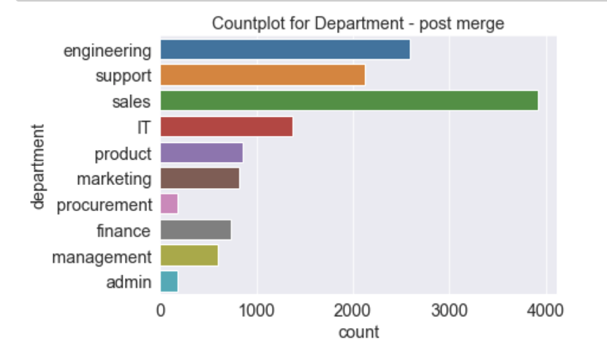
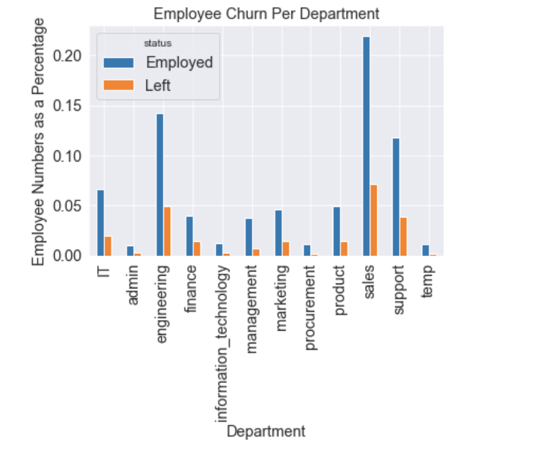

# Predicting Employee Churn

This project was completed as part of the General Assembly Data Science Immersive bootcamp. This document discusses the problem, hypothesis, methodology, conclusion, and tools used.

 

## Problem Statement
Employee turnover or churn is a costly problem for companies and is the rate at which an employer gains and losses employees. 
The cost of replacing an employee can be significant - because of the productivity losses when employees leave the workforce, the costs of hiring and training a replacement, and the slower productivity until they get up to speed in their new job. Studies show that the estimated cost of losing an employee can cost an organization between 150% - 200% of salary.
## Project Objective
Understanding why and when employees are most likely to leave can lead to actions to improve employee retention as well as possibly planning new hiring in advance. 
My objective for this project is to:
- Determine the likelihood of an employee leaving ("leaver")
- Determine the key indicators for a "leaver"
- Develop and deploy a model that supports the business in developing a strategic retention plan by identifying potential "leavers".

As the target variable is categorical, the machine learning task is **classification** and will be training several machine learning models using data about ***employee performance, happiness, experience, speciality, workload*** and ***tenure*** to predict if an employee is going to ***leave (Left)*** or ***stay (Employed).***
## Files in This Repository
- [Presentation slides](https://github.com/Chris-N-E/GA_Capstone_project/blob/main/Capstone_Presentation.key): This was prepared to present the project, results and recommendations to a non-technical audience.
- Jupyter Notebook files(.ipynb):
    
    - [Data Collection and Dataset](https://github.com/Chris-N-E/GA_Capstone_project/tree/main/Capstone_Kaggle_Download): Data source and overview
    - [Introduction](https://github.com/Chris-N-E/GA_Capstone_project/blob/main/Capstone_Modelling/Introduction.ipynb): Defines the problem being solved and the evaluation metric to be used.
    - [EDA](https://github.com/Chris-N-E/GA_Capstone_project/blob/main/Capstone_Modelling/EDA.ipynb): Libraries, Exploratory Data Analysis, Data Cleaning and Feature Engineering based on domain knowledge.
    - [Modelling](https://github.com/Chris-N-E/GA_Capstone_project/blob/main/Capstone_Modelling/Modelling.ipynb): Model training  of classification algorithms and performance evaluations using ROC-AUC and Confusion matrix.
    - [Model deployment](https://github.com/Chris-N-E/GA_Capstone_project/blob/main/Capstone_Modelling/Model_Deployment.ipynb): Final model evaluation, feature importance ranking and compiling data cleaning steps into a function for use on new data.
## Libraries Used
- Numpy
- Pandas
- Seaborn
- Matplotlib
- Scikit-Learn
- XGBoost
- Statistics

## Dataset
I used publicly available data on Kaggle and downloaded using a kaggle API. 

The dataset has 14249 observations for past/present employees spanning a 10 year period.
Each observation includes the employee’s current employment status.
There are 10 features (columns):
| Column Name  | Description |
| ------------- | ------------- |
| status  | Current employment status (Employed / Left)  |
| 	department  | Department employees belong(ed) to  |
| salary	  | Salary level relative to rest of their department  |
| tenure  | Number of years at the company  |
| recently_promoted  | Was the employee promoted in the last 3 years?  |
|filed_complaint  | Has the employee filed a formal complaint in the last 3 years?  |
| last_evaluation  | Score for most recent evaluation of employee (higher is better)  |
| avg_monthly_hrs  | Average number of hours worked per month  |
| n_projects  | Number of projects employee is staffed on  |

Target variable 'status' – Current employment status (Employed / Left). The Employed observations made up 76% of the dataset , and as such the dataset contained some class imbalance.

## Data Exploration and Processing

- Exploration of Numerical Features:

- Exploration of Categorical Features:

- Exploration of Target Variable:

- Data cleaning entailed:
    - Converting the NaN's in the numerical features to 0 and creating an indicator variable for missing data before converting the NaNs to 0.
    - Merging similar classes, creating new class for missing data and filtering out redundant calsses of the **department** feature.
    - One-hot encoding **department** and **salary** features
    - Converting target variable **status** to binary

